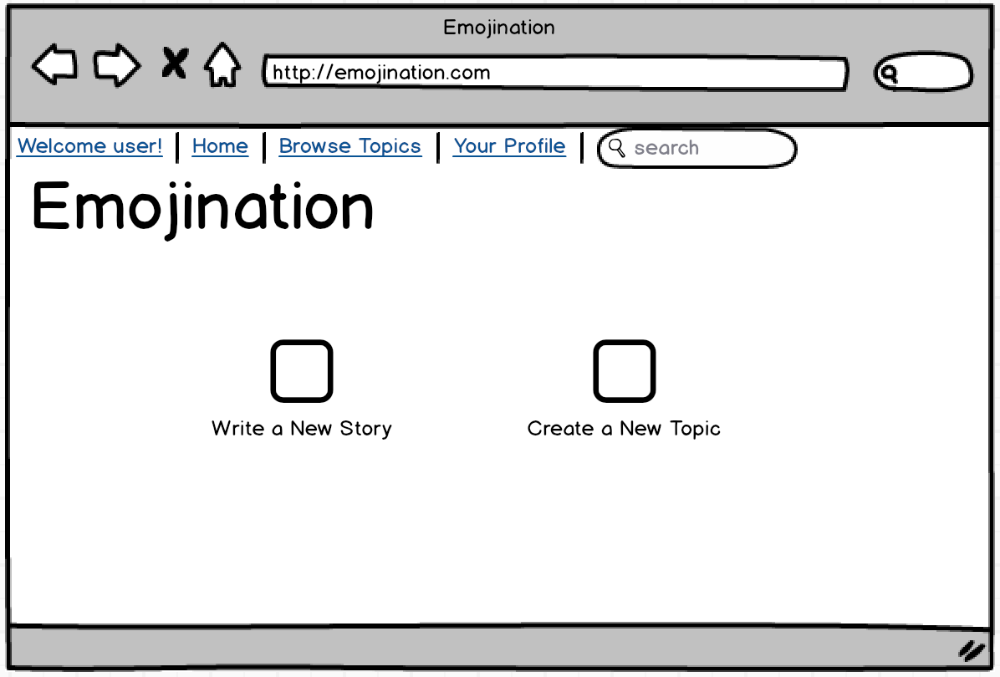
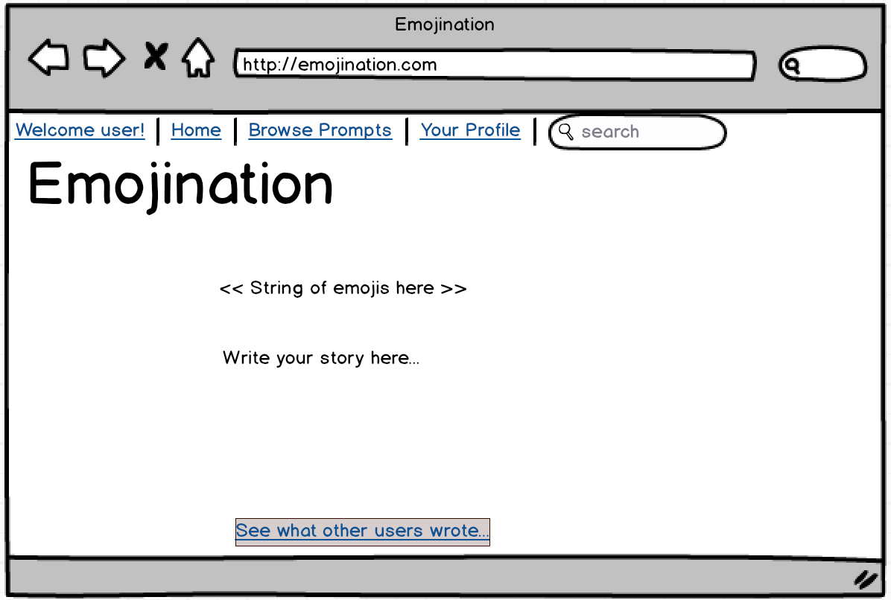

#README for Emojination

Based on an idea by Katie Ouaknine.

####Installation Instructions

####Technology (turn these into links)
* Parallax landing page that explains the concept with screen shots and some jazzy animation. (Note to self: [https://ihatetomatoes.net/how-to-create-a-parallax-scrolling-website/](). Also, worth investigating whether it is better to use something like scrollr or use pure css. )
* SASS
* Angular
* Passport
* Materialize (for now)
* Twemoji
* UI Router

####User Stories
* Users can create an Emojination (working title) account or log in.
* Users may be teens (13+) or adults.
* Users can select their favorite emoticon to be their avatar
* Users can scroll through a list of story "topics" (strings of 5-15 emoticons).
* Users can go to a topic page to read and up vote other users' stories.
* Users can contribute a new story to a "topic."
* Users can add a new topic.
* Users can edit their accounts (including a bio told in emoticons).
* Users can delete their accounts.
* Users can report abusive or profane content.
* Admin can ban users who are abusive towards other users.

####Icebox User Stories

* Users can follow other users.
* Users can have a profile pic (actual picture).
* Admin can put in temporary bans on users who violate the terms of service.
* There will be terms of service.
* Users can comment on others' stories (this may be more easily implemented with Disqus; I will investigate).

####Wireframes

