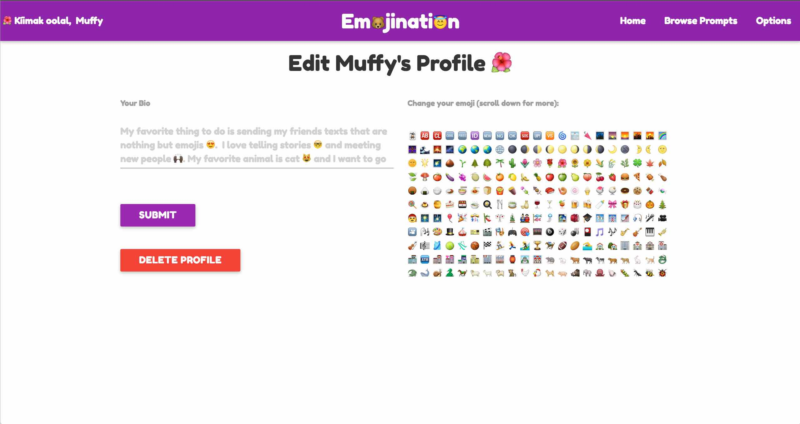

# README for Emojination
#### A MEAN-stack app that allows users to write stories prompted by emojis.
#### View the site at [here](https://emojinationapp.herokuapp.com/#/)
#### Based on an idea by [Katie Ouaknine](https://github.com/katajello).

### Technology
* [MongoDB](https://mlab.com/)
* [Express](https://github.com/expressjs/express)
* [Angular](https://angularjs.org/)
* [Node.js](https://nodejs.org/en/)
* [Passport](http://passportjs.org/)
* [Angular-Materialize](https://github.com/krescruz/angular-materialize)
* [Twemoji](https://github.com/twitter/twemoji) and [Angular-Twemoji](https://github.com/scheffield/angular-twemoji)
* [UI Router](https://github.com/angular-ui/ui-router)
* [Heroku](https://heroku.com/)

### Installation Instructions
In addition to the above dependencies, Emojination requires the following: bcrypt-nodejs, body-parser, cookie-parser, dotenv, express-session, passport-local, passport-local-mongoose, and serve-favicon. After forking or cloning, users must establish either a local mongoose database or an mlabs database.

### User Stories
* Users can create an Emojination account or log in with an existing account.
* Users can select their favorite emoticon to be their avatar.
* Users can scroll through a list of story prompts.
* Users can contribute a new story to a prompt.
* Users can edit their bio and avatar.
* Users can delete their accounts.

### Iceboxed User Stories
* Users can go to a topic page to read and up vote other users' stories.
* Users can follow other users.
* Users can add a new prompt.
* Users can have a profile pic (actual picture).
* Users can report abusive or profane content.
* Admin can ban users who are abusive towards other users.
* Admin can put in temporary bans on users who violate the terms of service.
* Users can comment on others' stories.
* Users can select a color for their profile.

### Known Bugs
* Currently all stories are showing up for all prompts. 

### Other Future Implementations
* A parallax landing page
* SASS styling
* Authentication with Twitter and Facebook
* Allowing users to share their stories via Facebook and/or Twitter.

### Wireframes

### Screenshots

### Pitch Deck
[Click here](PitchDeck_Emojination.pdf)
