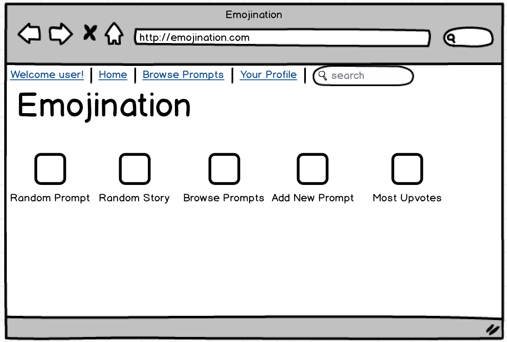

#README for Emojination
######A MEAN-stack app that allows users to write stories prompted by emojis. 
######View the site at [https://emojinationapp.herokuapp.com/#/]()
######Based on an idea by [https://github.com/katajello](Katie Ouaknine).

####Technology
* [https://mlab.com/](MongoDB)
* [https://github.com/expressjs/express](Express)
* [https://angularjs.org/](Angular)
* [https://nodejs.org/en/](Node.js)
* [http://passportjs.org/](Passport)
* [https://github.com/krescruz/angular-materialize](Angular-Materialize)
* [https://github.com/twitter/twemoji](Twemoji) and [https://github.com/scheffield/angular-twemoji](Angular-Twemoji)
* [https://github.com/angular-ui/ui-router](UI Router)
* [https://heroku.com/](Heroku)

####Installation Instructions
In addition to the above dependencies, Emojination requires the following: bcrypt-nodejs, body-parser, cookie-parser, dotenv, express-session, passport-local, passport-local-mongoose, and serve-favicon.

####User Stories
* Users can create an Emojination account or log in.
* Users can select their favorite emoticon to be their avatar.
* Users can scroll through a list of story prompts.
* Users can contribute a new story to a prompt.
* Users can edit their bio and avatar.
* Users can delete their accounts.

####Iceboxed User Stories
* Users can go to a topic page to read and up vote other users' stories.
* Users can follow other users.
* Users can add a new prompt.
* Users can have a profile pic (actual picture).
* Users can report abusive or profane content.
* Admin can ban users who are abusive towards other users.
* Admin can put in temporary bans on users who violate the terms of service.
* Users can comment on others' stories.
* Users can select a color for their profile.

####Other Future Implementations
* A parallax landing page
* SASS styling
* Authentication with Twitter and Facebook
* Allowing users to share their stories via Facebook and/or Twitter.

####Wireframes

####Screenshots

####Pitch Deck

